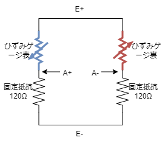
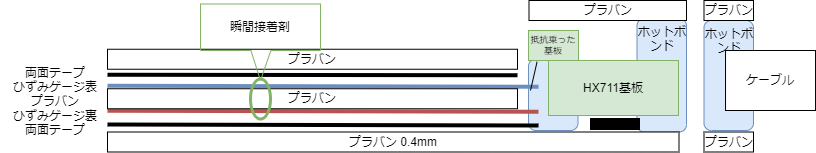
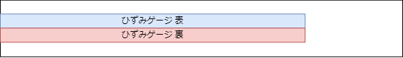
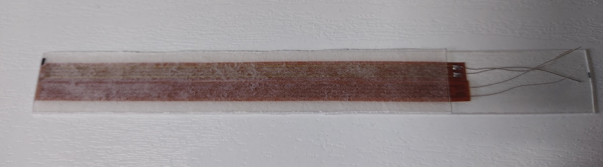
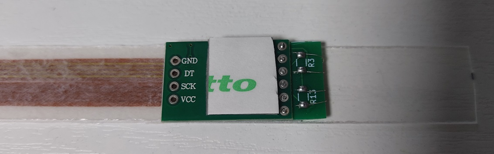
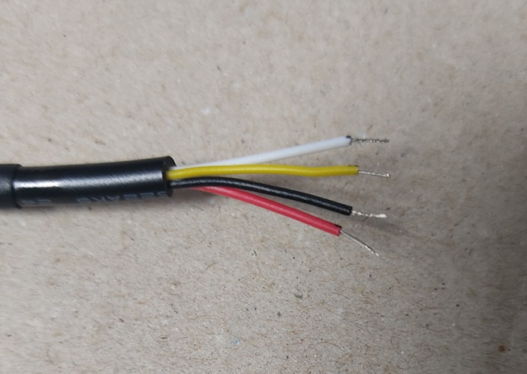
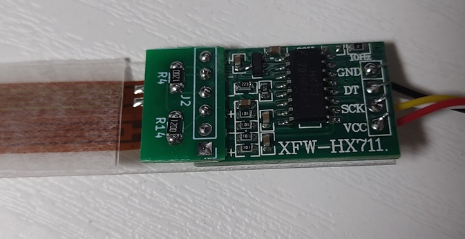
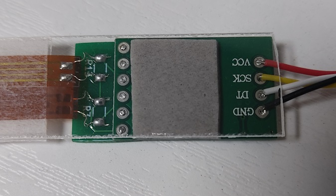
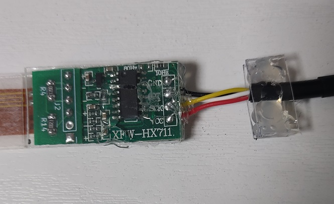

# ひずみゲージでスキー板のたわみを測る

[Arduino UNO R4もどきのボードと自作基板](https://github.com/tom01h/RA4M1)を使って実験します

事情あって、センサー部分は実際にスキー場で使っているものですが、制御部分はスキー場で使っているものとは別のものです

センサー部分は[ひずみゲージ](https://ja.aliexpress.com/item/1005003672107724.html)（BX120-100AA）と[HX711](https://ja.aliexpress.com/item/1005004245273524.html)（Mini Board）をちょい変(3.3V化)したものを使います

## Arduinoもどき

制御には[Arduino UNO R4もどきのボードと自作基板](https://github.com/tom01h/RA4M1)を使います

D5端子がクロック、D2,D3,D4端子がデータ入力端子です

プログラムは`BendingSensor.ino`です  
LCDに計測値を表示するためにu8g2ライブラリを使います

1秒に10回計測値を表示、最初の10回はゼロキャリブレーションに使います

### ピン配置
下の絵ではJ5,J9がDATA0(D4)で、絵には無いけどJ10,J11がDATA1(D3)でJ15,J16がDATA2(D2)です  
それぞれ、どちらか一方のコネクタを使います

## センサー

### HX711を改造する
3.3Vに対応するために[ここ](https://kohacraft.com/archives/202103201133.html)の真似をして改造します  
(合成抵抗違うくね？って気はしますが…)  
とっても細かい作業です

2個のひずみゲージと組み合わせてホイートストンブリッジを作るための基板が`hx711.kicad_XX`です  
切り取って使います  
0.8mm厚で作りました  
あまり良くないと言われている基板同士のはんだ付け

### 回路
(E+)-(A+)間にひずみゲージを表向きに、(E+)-(A-)間にひずみゲージを裏向きに、(A+)-(E-)と(A-)-(E-)間は固定の抵抗(120Ω)をつなぎます  
2枚使っているのは温度補償のためなんだけど、スキー板の表裏に貼るわけにもいかなくて同じ平面上に貼っているので変化を打ち消しあっている気もします    
けど、なんとなく動いているのでまぁ良いかぁ

### 設計図（のようなもの）
断面図

センサー部分は下から
- 150mm x 15mm のプラバン（0.4mm厚）
- 両面テープ
- ひずみゲージ（裏表両方）
- 両面テープ
- 100mm x 15mm のプラバン（0.4mm厚）

HX711をプラバンに止めているのは1.2mm厚の両面テープ

センサー部分の平面図

### 組み立て
#### センサー部分

#### センサーとHX711接続
下の写真はHX711基板は裏返った状態

#### ケーブルの加工

4芯のケーブルは[これ](https://ja.aliexpress.com/item/4000570401041.html)の`AWG28 4Core`を使っているのだけど、ちょっと固すぎな気がします  
センサー（HX711）側は外皮（黒いの）2㎝だけむいて、中の線は5mmだけむいています  
外皮をむくのには[これ](https://ja.aliexpress.com/item/1005005504458064.html)を使っています  
制御基板側は長めに外皮（黒いの）をむいて、熱収縮チューブで保護しています

#### ケーブルに接続
1枚目が表から見た絵で2枚目が裏から見た絵

#### ホットボンド

#### 熱収縮チューブ

長さ16㎝に切った直径12mmの[熱収縮チューブ](https://ja.aliexpress.com/item/32838965930.html)`12mm`を全体の保護に使います  
アイロンで加熱しますが、加熱しすぎに注意！！

