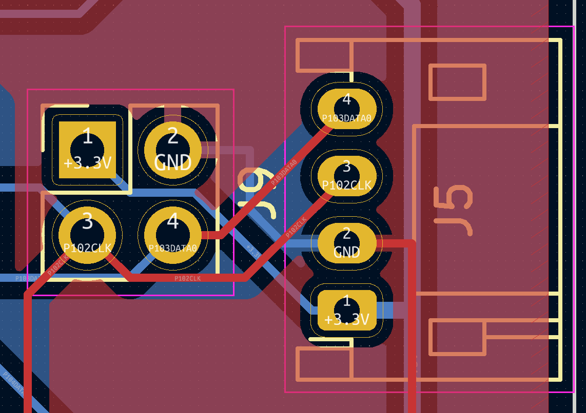
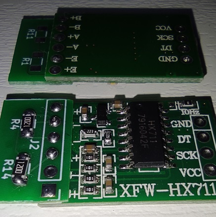

# ひずみゲージでスキー板のたわみを測る

[Arduino UNO R4もどきのボードと自作基板](https://github.com/tom01h/RA4M1)を使って実験します

事情あって、センサー部分は実際にスキー場で使っているものですが、制御部分はスキー場で使っているものとは別のものです

センサー部分は[ひずみゲージ](https://ja.aliexpress.com/item/1005003672107724.html)（BX120-100AA）と[HX711](https://ja.aliexpress.com/item/1005004245273524.html)（Mini Board）をちょい変(3.3V化)したものを使います

## Arduinoもどき

[Arduino UNO R4もどきのボードと自作基板](https://github.com/tom01h/RA4M1)を使います

D5端子がクロック、D2,D3,D4端子がデータ入力端子です

プログラムは`BendingSensor.ino`です  
LCDに計測値を表示するためにu8g2ライブラリを使います

1秒に10回計測値を表示、最初の10回はゼロキャリブレーションに使います

### ピン配置
下の絵ではJ5,J9がDATA0(D4)で、絵には無いけどJ10,J11がDATA1(D3)でJ15,J16がDATA1(D2)です  
それぞれ、どちらか一方のコネクタを使います

## センサー

### HX711を改造する
3.3Vに対応するために[ここ](https://kohacraft.com/archives/202103201133.html)の真似をして改造します  
(合成抵抗違うくね？って気はしますが…)  
とっても細かい作業です

2個のひずみゲージと組み合わせてホイートストンブリッジを作るための基板が`hx711.kicad_XX`です  
切り取って使います  
0.8mm厚で作りました  
あまり良くないと言われている基板同士のはんだ付け

